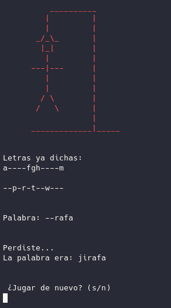

# Juego de [_El ahorcado_](https://es.wikipedia.org/wiki/Ahorcado_(juego)) en BASH

Este es el clásico juego de el ahorcado escrito en Bash.

Simplemente descarga o clona el repositorio, y ejecuta el archivo:

> ./hangman

Y podrás escoger entre jugar en inglés (y adivinar palabras en inglés del archivo dict_en.dat) o en español (con palabras en español de dict_es.dat).

La cuestión es adivinar la palabra elegida de manera aleatoria diciendo letras. Por cada letra acertada, esta se mostrará en la palabra. Por cada letra equivocada, se añadirá una parte _del ahorcado_.

El objetivo es adivinar la palabra antes de que se acaben las opciones... ¿Te atreves al reto?

En esta versión actualizada, además de añadir texto y palabras en español, también he hecho algunas otras mejoras visuales.

El aprender a programar en Bash como sinónimo de entretenimiento, eso es ser muy __geek__

Corrige, mejora, y sobre todo ¡Disfruta!

---

# Hangman in BASH
A basic UNIX terminal based hangman game written in Bash.

This is a hangman game that I wrote in the Bourne again shell (Bash UNIX shell) while trying to learn some of the syntax. The main game is started by executing the hangman script using:

> ./hangman

in a bash terminal. This game looks for a dict.dat file full of words that are randomly selected from.

Enjoy!
